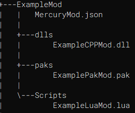

# Mercury Mod Manager Modding guide

Before continuing through this guide, keep in mind Mercury Mod Manager is currently *still in development*!

## Making your current mod compatible with Mercury

### Setting up your Mercury mod folder structure
Mercury requires its mods to be packaged in a specific folder structure to easily be read.
Example Mod Folder:



All Mercury mods will need a MercuryMod.json file to store the mods metadata. It is import that this file is named exactly
as "MercuryMod.json". Here is how you should setup your json:

```
{
    "id": "ExampleMod",
    "version": "1.0.0",
    "name": "Example Mod",
    "description": "An example mod to show how to setup Mercury mods",
    "authors": [
        "Nadz"
    ],
    "mwsid": "",
    "nexusid": "",
    "license": "MIT",
    "icon": "",
    "contact": {
        "homepage": "",
        "sources": ""
    }
}
```

Key Notes:
- ID = A unique identifier for your mods. Mods with the same ID will conflict.
- Version = The current version of the mod. It is highly recommended that you use [Semantic Versioning](https://semver.org)
            here; In reality you can use whatever format you want as long as your mod on ModWorkShop or Nexus matches the
            formatting.
- Name = The name of the mod.
- Description = A description of what the mod does.
- Authors = Any mod authors involved in the making of the mod.
- MWSID = The ModWorkshop ID of the mod. Can usually be find in the URL of the mod page. For example.
          Mercury Mod Managers MWSID would be **47668** as found in the URL: https://modworkshop.net/mod/47668
          . This is used to retrieve versioning information on your mod and allows the mod manager to notify the players
          when your mod has been updated.
- NexusID = The Nexus ID of the mod. **Currently Nexus mods are not supported.** However when it is, we will update this
            document with relevant information. This is used to retrieve versioning information on your mod and allows 
            the mod manager to notify the players
            when your mod has been updated.
- License = The license that you decide to choose for your mod.
- Icon = A 64x64 transparent png of your mods icon. **Currently unused**
- Contact = Links to your mods homepage and sources.

Currently Mercury can only extract .zip meaning you will have to compress your folder into a zip archive as such.
This will be what you provide to your users. Instruct them to extract this archive into
```{GamePath}\PAYDAY3\PAYDAY3\Binaries\Win64\Mods``` or ```{GamePath}\PAYDAY3\PAYDAY3\Binaries\WinGDK\Mods```
depending on where they installed the game from. On startup, Mercury will detect the pak mods in these and automatically
add them to the Load order list and mount them according to the order of this list.  


### Quick Mod Testing with Hotswapping
Once you have your mod compatible with Mercury, you can use the mod managers hotswapping features to test changes to pak
mods without having to reload the game. 
- **CURRENTLY HOTSWAPPING IS VERY EXPERIMENTAL AND MAY NOT WORK ON ALL ASSETS!!!**

To hotswap a pak, rename the updated pak with '.staged' at the end and add it to the 
```{GamePath}\PAYDAY3\PAYDAY3\Mercury\Mods``` folder. 
The mod manager will detect this change and replace the old pak with the new one. This is very experimental.
The affected assets need to be reloaded e.g: if you are currently in a heist, quit to the main menu then head to the mods
tab and restart mods. 

Note: On startup, Mercury will replace these hotswapped paks back to the paks found in 
```{GamePath}\PAYDAY3\PAYDAY3\Binaries\Win64\Mods``` folder. 
